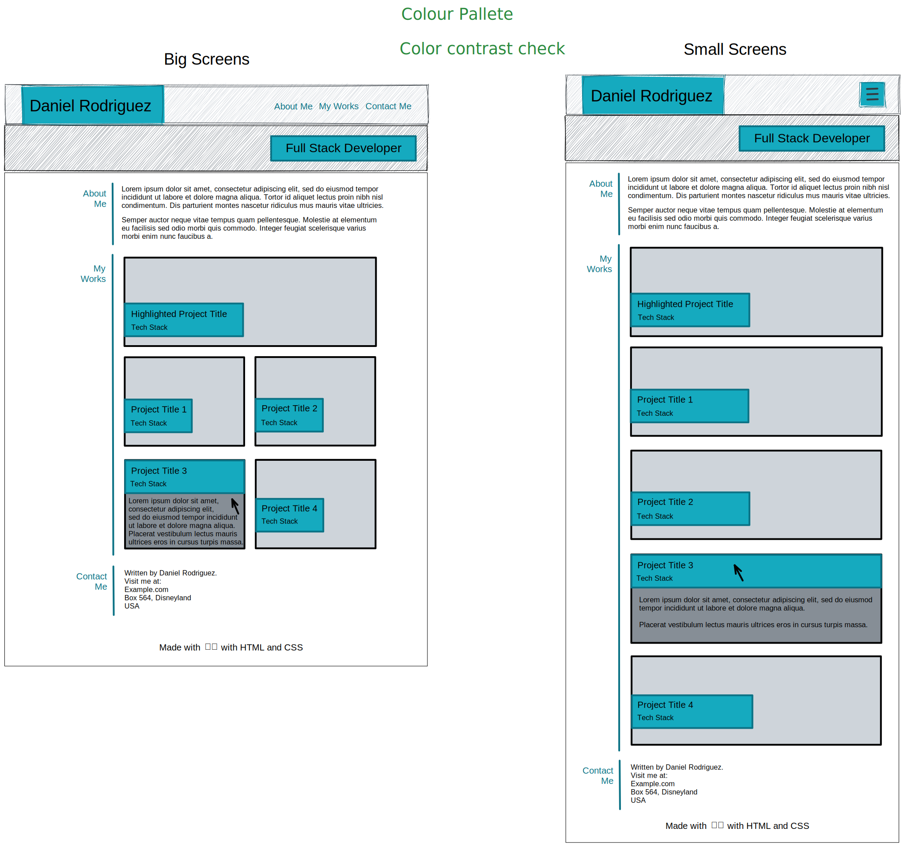

# Bootstrap Portfolio Challenge: Refactor portfolio with UX and Advanced CSS

## Table of contents

- [Bootstrap Portfolio Challenge: Refactor portfolio with UX and Advanced CSS](#bootstrap-portfolio-challenge-refactor-portfolio-with-ux-and-advanced-css)
  - [Table of contents](#table-of-contents)
  - [Overview](#overview)
    - [The challenge](#the-challenge)
    - [Screenshots](#screenshots)
    - [Links](#links)
  - [My process](#my-process)
    - [Built with](#built-with)
    - [What I learned](#what-i-learned)
    - [Continued development](#continued-development)
    - [Useful resources](#useful-resources)
  - [Author](#author)
  - [Acknowledgments](#acknowledgments)

## Overview

This is the Bootcamp week 3 challenge project where the portfolio layout from the [week 2 challenge](https://technoveltyco.github.io/bootcamp-week2-challenge/) will be refactored using the [Bootstrap CSS Framework (version 4)](https://getbootstrap.com/docs/4.0/getting-started/introduction/).

### The challenge

In this challenge, the portfolio layout from the [week 2 challenge](https://technoveltyco.github.io/bootcamp-week2-challenge/) will be refactored using the [Bootstrap CSS Framework (version 4)](https://getbootstrap.com/docs/4.0/getting-started/introduction/).

The final portfolio website should meet the following *Acceptance Criteria*:

1. The website include the following Bootstrap components:

    - A Navigation bar
    
    - A navigation menu at the top. Feel free to use bootstrap's navbar or create your own.

      - Include links that are applicable to your portfolio.
  
        - Links should navigate to the appropriate sections 

    - A hero section

        - A jumbotron featuring your picture, your name, and any other information you'd like to include.

    - A work section

      - A section displaying your work in grid. 

        - If you need to use placeholder image use: https://placehold.co/ 

      - Use bootstrap cards for each project.

        - The description should give a brief overview of the work.

      - Each project will eventually link to your class project work!

    - A skills section

      - List out the skills you expect to learn from the bootcamp.

    - An about / contact section.

      - An "About Me" section in the same row.
    
    - A footer section.

      - All hyperlinks should have a hover effect.

      - All buttons should display a box shadow upon hover.

2. The Bootstrap solution should minimize use of media queries.

3. Deploy your new Bootstrap-powered portfolio to GitHub Pages.


### Screenshots




### Links

- Solution URL: [https://github.com/technoveltyco/bootcamp-week3-challenge](https://github.com/technoveltyco/bootcamp-week3-challenge)
- Live Site URL: [https://technoveltyco.github.io/bootcamp-week3-challenge/](https://technoveltyco.github.io/bootcamp-week3-challenge/)

## My process

The boilerplate code was the final output from the [week 2 challenge repo](https://github.com/technoveltyco/bootcamp-week2-challenge), and the approach was about refactoring the HTML layout with Bootrap 4 components
### Built with

- Semantic HTML5 markup
- CSS custom properties
- Flexbox
- CSS Grid
- Mobile-first workflow
- [Bootstrap 4](https://getbootstrap.com/docs/4.0/getting-started/introduction/)

### What I learned

The biggest challenge was refactoring the project cards, without using the [Bootstrap card component](https://getbootstrap.com/docs/4.0/components/card/). I decided to be more ambitious and create my own responsive solution for this section, using semantic `figure` and `figcaption` to make the project pictures more accessible, and including a `hover` effect to include and scrollable contextual info of the project, while providing links to the repos and live sites of each project.


The main code used for this snippets can be seen below:

```html
<!-- project card (highlighted) -->
<article class="container project highlighted">

  <figure class="figure">

    

    <!-- project hover info -->
    <figcaption class="figure-caption">
      <h3>Run Buddy</h3>

      <p>
        Lorem ipsum, dolor sit amet consectetur adipisicing elit. Placeat alias necessitatibus modi! Sapiente nisi optio expedita cum reprehenderit.
      </p>

      <div class="list-group">
        <a class="list-group-item list-group-item-action active" 
            href="https://technoveltyco.github.io/prework-study-guide/" target="_blank">
          See Run Buddy sample <i class="bi bi-link-45deg"></i>
        </a>

        <a class="list-group-item list-group-item-action" 
            href="https://github.com/technoveltyco/prework-study-guide" target="_blank">
          Check out Run Buddy code <i class="bi bi-github"></i> <i class="bi bi-link-45deg"></i>
        </a>
      </div>
    </figcaption>
    <!-- end project hover info-->

  </figure>

  <div class="info">
    <h3>Run Buddy</h3>
    <h4>MERN Stack</h4>
  </div>

</article>
<!-- end project card (highlighted) -->
```

```css
#work .portfolio {
  display: grid;
  grid-template-columns: var(--pf-columns-large);
  grid-template-rows: var(--pf-rows-large);
  grid-template-areas: 
    'main main'
    '. .'
    '. .'
    ;
}

#work .portfolio .project.highlighted {
  grid-area: main;
}

#work .portfolio .project {
  position: relative;
  max-width: 100%;
  height: 100%;
  padding: 20px;
}

#work .portfolio .project figure {
  position: relative;
  width: 100%;
  height: 100%;
}

#work .portfolio .project figure img {
  width: 100%;
  height: 100%;
  object-fit: fill;
}

#work .portfolio .project figure figcaption,
#work .portfolio .project .info {
  position: absolute;
}

#work .portfolio .project figure figcaption {
  opacity: 0;
  top: 0;
  z-index: 10;
  height: 100%;
  font-size: var(--font-size-small);
  padding: 1em;
  color: var(--light-text);
  background: var(--primary-color);
}

#work .portfolio .project:hover figure figcaption {
  opacity: 1;
  overflow-y: scroll;
}

#work .portfolio .project .info {
  bottom: 15%;
  background-color: var(--secondary-color);
  padding: 10px;
}

#work .portfolio .project.highlighted .info {
  bottom: 20%;
}

#work .portfolio .project .info h3,
#work .portfolio .project .info h4 {
  color: var(--light-text);
}

#work .portfolio .project .info h3 {
  font-size: var(--font-size-large);
}

#work .portfolio .project .info h4 {
  font-size: var(--font-size-medium);
  display: inline-block;
}
```

### Continued development

Next steps wil be to iterate into a second round of UI/UX designs, including detailed user workflows for diferent screen sizes, a printer friendly version, and detailed wireframes and mockups following [Atomic Design Principles and Methodologies](https://xd.adobe.com/ideas/process/ui-design/atomic-design-principles-methodology-101/).

### Useful resources

- [Bootstrap 4 documentation](https://getbootstrap.com/docs/4.0/getting-started/introduction/) - The official documentation where you have a lot of examples on how to use and integrate the Bootstrap components.
- [W3C School Bootstrap 4 Tutorial](https://www.w3schools.com/bootstrap4/default.asp) - It contains a lot of examplesand code snippets to play.
- [W3C School CSS Tutorial](https://www.w3schools.com/css/default.asp) - It helped as a reference mostly for flexbox and grid properties and browser compatibilities.
- [MDN Reference](https://developer.mozilla.org/en-US/) - main reference for depper understanding of the semantic HTML and advanced CSS properties.
- [W3C School HTML Tutorial](https://www.w3schools.com/html/default.asp) - alternative reference for semantic and accessible HTML code snippets.
- [Bootstrap Icons](https://icons.getbootstrap.com/) - main reference that looked up for many of the SVG icons used in the skill section.
- [W3C SVG Tutorial](https://www.w3schools.com/graphics/svg_intro.asp) - quick reference to understand SVG images that were used in the skill badges.
- [Wikimedia Commons](https://commons.wikimedia.org/wiki/Main_Page) - additional svg image open source resources that were used in the skill badges.

## Author
  Daniel Rodríguez
- GitHub - [technoveltyco](https://github.com/technoveltyco)

## Acknowledgments

The teacher and TAs that help us with resources and support to my questions during the development of this challenge.
